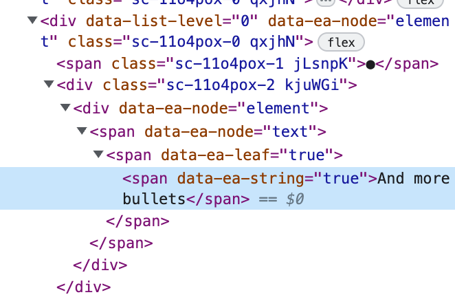

不使用 contenteditable 而是自己维护了一套渲染机制

- [playground](https://docs.editablejs.com/playground)

以下是一些知名的开源富文本编辑器项目：

1. **CKEditor**：一个功能强大的富文本编辑器，具有丰富的编辑功能和可扩展的插件系统。它支持多种浏览器和平台，并提供可定制的用户界面。

2. **Quill**：一个现代化的富文本编辑器，具有简洁的界面和直观的操作。它提供了丰富的编辑功能，包括格式化、嵌入式媒体和实时协作等特性。

3. **TinyMCE**：一个流行的富文本编辑器，被广泛用于网页和应用程序开发。它提供了可定制的工具栏、样式和插件，支持多种浏览器和平台。

4. **Draft.js**：由Facebook开发的富文本编辑器框架，基于React构建。它提供了强大的编辑能力和可定制的组件，适用于构建定制化的富文本编辑器。

5. **Slate**：一个灵活的富文本编辑器框架，基于React构建。它允许开发者完全控制编辑器的行为和外观，并支持自定义的编辑器组件。

6. **ProseMirror**：一个可扩展的富文本编辑器框架，具有先进的编辑能力和强大的数据模型。它提供了可编程的编辑器行为，适用于构建定制化的编辑器解决方案。

这些开源项目提供了不同的富文本编辑器解决方案，每个项目都有其独特的特点和用途。你可以根据你的需求和技术栈选择适合你的开源富文本编辑器项目，并根据需要进行定制和扩展。

除了之前提到的开源富文本编辑器项目，还有一些其他富文本编辑器可供选择，包括：

1. **Froala Editor**：一个功能丰富的富文本编辑器，具有直观的用户界面和可定制的工具栏。它支持响应式设计和媒体管理。

2. **Summernote**：一个简单易用的富文本编辑器，具有强大的文本格式化和图片上传功能。它支持实时预览和自定义插件。

3. **Redactor**：一个现代化的富文本编辑器，提供直观的界面和丰富的编辑功能。它具有可定制的工具栏和响应式设计。

4. **Trix**：一个简洁而强大的富文本编辑器，专注于易用性和可访问性。它提供了内联编辑和附件处理的功能。

5. **Editor.js**：一个块级富文本编辑器，用于构建结构化的内容。它支持不同类型的内容块，如段落、标题、图像和引用等。

这些富文本编辑器都有各自的特点和用途，可以根据你的需求和偏好选择合适的富文本编辑器。无论你需要一个功能丰富的编辑器还是一个简单易用的解决方案，这些编辑器都可以满足不同的需求。

Medium Editor：一个轻量级的富文本编辑器，模仿了Medium博客的编辑体验，支持基本的文本格式和链接嵌入。

当然，还有一些其他的富文本编辑器可供选择：

1. **Trumbowyg**：一个轻量级的富文本编辑器，支持多种浏览器，具有简洁的用户界面和基本的编辑功能。

2. **NicEdit**：一个简单易用的富文本编辑器，支持实时预览、图片上传和自定义样式等特性。

3. **Ckeditor 5**：CKEditor的最新版本，重新设计并重构为现代化的富文本编辑器，提供了更好的性能和可扩展性。

4. **Jodit Editor**：一个现代化的富文本编辑器，具有可定制的界面和丰富的编辑功能，支持实时协作和图片上传等功能。

5. **Bootstrap Editor**：基于Bootstrap框架的富文本编辑器，提供了与Bootstrap样式集成的编辑功能和组件。

请注意，这里列举的富文本编辑器只是其中的一部分，市场上还有许多其他的富文本编辑器可供选择。你可以根据自己的具体需求和偏好进行评估和选择。